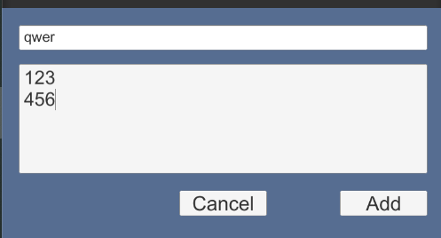

# Notebook

The idea for this app/tutorail came from the fact that I once struggled
with a unity application that had to use JWT and oAuth2 tokens.
With this project, I can save someone some time and trouble - i think.
The whole of this project is a simple application to create and display notes.
To display notes, the user logs into the application, they can
add and view their notes.

As a backend I used **.Net 5** and **Asp.Net Core**, client-side application **Unity3D**.
For authentication I used **Keycloak**.

Missing from the Api:
- account creation
- token refreshing
- logout

An application needs a database and an authentication service to run.
Using **Docker** you can run it locally.

```yaml
version: '3.7'

networks:
  keycloak-network:
    external: true

services:
    postgres:
      container_name: app-postgres
      image: postgres:10.5
      restart: always
      environment:
        - POSTGRES_DB=foo
        - POSTGRES_USER=admin
        - POSTGRES_PASSWORD=admin
      logging:
        options:
          max-size: 10m
          max-file: "3"
      ports:
        - "5432:5432"
      volumes: 
        - ./postgres-data:/var/lib/postgresql/data
        # copy the sql script to create tables
        - ./sql/create_tables.sql:/docker-entrypoint-initdb.d/create_tables.sql
      networks:
        - keycloak-network

```

```yaml
version: '3.7'

networks:
  keycloak-network:
    external: true

services:
  keycloak:
    container_name: app-keycloak
    restart: always
    environment:
      # admin acount
      - KEYCLOAK_USER=foo
      - KEYCLOAK_PASSWORD=foo

      # PostgreSQL DB settings
      - DB_VENDOR=POSTGRES
      - DB_ADDR=postgres
      - DB_PORT=5432
      - DB_DATABASE=foo
      - DB_SCHEMA=public
      - DB_USER=admin
      - DB_PASSWORD=admin

    image: "jboss/keycloak:10.0.2"
    ports: 
      - "8080:8080"
    networks:
      - keycloak-network
```

## Keycloak
<hr style="height:2px; background-color:gray;">

Keycloak preparation is best started with **Realm** to manage tor identities.
To log in to the service: http://localhost:8080 
 - <span style="color:LightSteelBlue">Login</span> *admin* 
 - <span style="color:LightSteelBlue">Hasło</span> *admin*

### **Realm**

Creates a new separate space for 
<span style="color:LightSteelBlue">customers, roles and users</span>


I left only **RSA RS256** for token verification.
This can be found in the <span style="color:LightSteelBlue">Realm Settings->Keys->Active</span>
Verification will only be done, with downloaded certificates from Keycloak.

```http request
GET http://localhost:8080/auth/realms/{nazwa realm}/protocol/openid-connect/certs
```

### **Client**

The customer is <span style="color:LightSteelBlue">application / server</span>,
which asks for authentication in **Keycloak**.
Adding a new customer **Clients->Create**, with **Access Type**, **Public**

In **Roles->Realm Roles** I created a new role: **note**

### **Users**

Because can't add new users to the app. <br />
I added the new user directly in **Keycloak**.

## REST Api
<hr style="height:2px; background-color:gray;">

Rest Api is responsible for adding new notes, and
getting the whole list, created by the user.

- **Get** <span style="color:LightSteelBlue">/Note</span> - returns a list of notes
  - <span style="color:LightSteelBlue">Positon</span>: Initial list item
  - <span style="color:LightSteelBlue">Size</span>: Number of downloadable items
- **Post** <span style="color:LightSteelBlue">/Note</span> - add new note

```json
{
  "topic": "string",
  "desc": "string"
}
```

Authentication is done in the following way,
in **Startup** I download certificates for token verification.

```c#
public Startup(IConfiguration configuration)
{
    ...
    SecurityCerts = GetSecurityKeys(Configuration["Jwt:Issuer"]);
}
```
```c#
private static IList<SecurityKey> GetSecurityKeys(string issuer)
{
    var client = new RestClient($"{issuer}/protocol/openid-connect/certs");
    var request = new RestRequest(Method.GET);
    var restResponse =  client.Execute<KeycloakCertsModel>(request);
    if (restResponse.StatusCode != HttpStatusCode.OK)
        throw new SecurityKeysException("I can't dawnload the certificate list");

    var result = restResponse.Data
        .Keys
        .Cast<SecurityKey>()
        .ToList();
    return result;
}
```

I put the list of certificates in **IssuerSigningKeys**

```c#
  services
  .AddAuthentication(options =>
  {
      options.DefaultScheme = JwtBearerDefaults.AuthenticationScheme; 
      options.DefaultAuthenticateScheme = JwtBearerDefaults.AuthenticationScheme;
      options.DefaultChallengeScheme = JwtBearerDefaults.AuthenticationScheme;
  })
  .AddJwtBearer(options =>
  {
      options.Authority = Configuration["Jwt:Issuer"];
      options.Audience = Configuration["Jwt:Audience"];
      options.RequireHttpsMetadata = false;
      
      options.TokenValidationParameters = new TokenValidationParameters
      {
          ValidateAudience = true,
          ValidateIssuerSigningKey = true,
          ValidateIssuer = true,
          ValidateLifetime = false,
          IssuerSigningKeys = SecurityCerts
      };
  });
```

```json
  "Jwt": {
    "Audience": "account",
    "Issuer": "http://localhost:8080/auth/realms/Comment_realm"
  },
```

## Application Note (Unity3D)
<hr style="height:2px; background-color:gray;">

After logging into the app, you can view all the notes, or and add new ones. 
And this is all we can do on the side of the application.




The stage is **canvas** with having three panels:
- Login
- NotesList
- NewNote

> Views

These are the three views of the application.

```c#
    public class LoginView : MonoBehaviour, IView
    {
        [Inject] private ILoginController _loginController;
        [Inject] private IBrokerMessage _msg;

        /* 
        ...
        */
        
        private void OnLogin() { }
    }
    
    public class NewNoteView : MonoBehaviour, IShowHideView, IView
    {
        [Inject] private INoteController _noteController;
        [Inject] private IBrokerMessage _msg;

        /* 
        ...
        */
        
        private void AddNote() { }
    }
    
    public class NoteView : MonoBehaviour, IShowHideView, IView
    {
        [Inject] private INoteController _noteController;
        [Inject] private IBrokerMessage _msg;

        /* 
        ...
        */
        
        private void InsertNotesToScroll(TaskAwaiter<IList<NoteModel>> notesAwaiter, Action onEnd = null) { }
    }
```

I used a simple **message broker** to communicate between views.
based on an observer.

```c#
    public class BrokerMessage : IBrokerMessage
    {
        private readonly ISubject<IMessage> _messages = new Subject<IMessage>();

        public void Publish(IMessage message) => _messages.OnNext(message);
        public IObservable<TMsg> Receive<TMsg>() => _messages.OfType<IMessage, TMsg>();
    }
```

The messages it isn't much, there are two

```c#
    public class AddNoteMessage : IMessage
    {
        public Type Receiver { get; set; }
        public IView Sender { get; set; }
        public NoteModel NewNote { get; set; }
    }
    
    public class ViewMessage : IMessage
    {
        public Type Receiver { get; set; }
        public IView Sender { get; set; }
        public ViewMessageEnum Message { get; set; }
    }    
```
Sending a message

```c#
  _msg.Publish(new ViewMessage
  {
      Receiver = typeof(NoteView),
      Sender = this,
      Message = ViewMessageEnum.Show
  });
  
  _msg.Receive<ViewMessage>()
    .Where(n =>
        n.Receiver == typeof(NewNoteView)
        && n.Message == ViewMessageEnum.Show)
    .Subscribe(_ => Show())
    .AddTo(gameObject);
```

<br />

> Controllers

### LoginController

It is responsible for logging in, token downloading
and its verification.

```c#
public class LoginController : ILoginController
{
    public string Token { get; private set; }
    
    public async Task<(bool, string)> Login(string userName, string password)
    {
    }
}
```

Downloading a token

```c#
var client = new RestClient(_loginInfoModel.urlAccesToken);
var request = new RestRequest(Method.POST);
request.AddHeader("Content-Type", "application/x-www-form-urlencoded");
request.AddParameter(
    "application/x-www-form-urlencoded",
    $"client_id={_loginInfoModel.clientId}&grant_type=password&scope=openid&username={userName}&password={password}", 
    ParameterType.RequestBody);

var response = await client.ExecuteAsync(request);
var keycloakToken = JsonConvert.DeserializeObject<KeycloakTokenModel>(response.Content);
```
The next step is to verify it

```c#
var certs = await GetCerts();
foreach (var key in certs.Keys)
{
    var result = GetToken(keycloakToken.AccessToken, key);
    if (result == null) continue;
    return !SetParams(result, keycloakToken.AccessToken) ? (false, "I don't have a permition") : (true, "");
}
```
```c#
private async Task<Certs> GetCerts()
{
    var client = new RestClient(_loginInfoModel.urlCerts);
    var request = new RestRequest(Method.GET);
    var result = await client.ExecuteAsync(request);
    if (result.StatusCode != HttpStatusCode.OK)
        throw new RestException("");

    return JsonConvert.DeserializeObject<Certs>(result.Content);
}
```

```c#
private static JWTokenModel GetToken(string token, KeycloakCertModel key)
{
    try
    {
        var urlEncoder = new JwtBase64UrlEncoder();
        var rsaKey = RSA.Create();
        rsaKey.ImportParameters(new RSAParameters
        {
            Modulus = urlEncoder.Decode(key.PublicKey),
            Exponent = urlEncoder.Decode(key.Exponent)
        });
        var result = new JwtBuilder()
            .WithAlgorithm(new RS256Algorithm(rsaKey))
            .MustVerifySignature()
            .Decode<JWTokenModel>(token);
        return result;
    }
    catch (Exception)
    {
        return null;
    }
}
```

### NoteController

It is responsible for adding and retrieving notes

```c#
public class NoteController : INoteController
{
    public async Task<IList<NoteModel>> GetFirstNotesPackAsync(int size) {}
    public async Task<IList<NoteModel>> GetNotesPackAsync(int size) {}
    public async Task<(string, string)> AddNewNote(NoteModel value) {}
}
```

The plugins that are needed, and which we have to download "manually" and place
in the plugins folder are:
- JWT
- Newtonsoft.Json
- RestSharp

